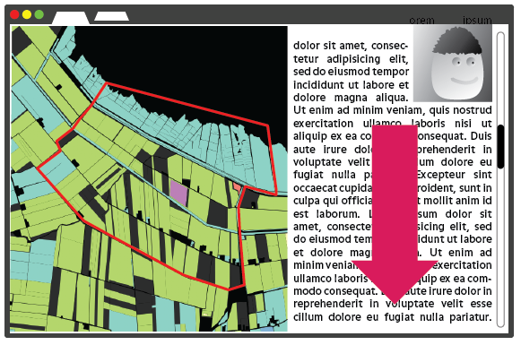
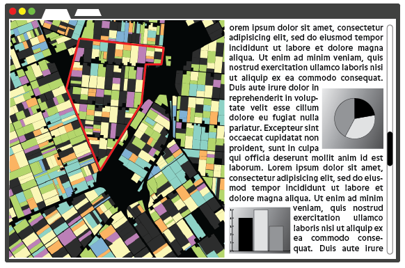
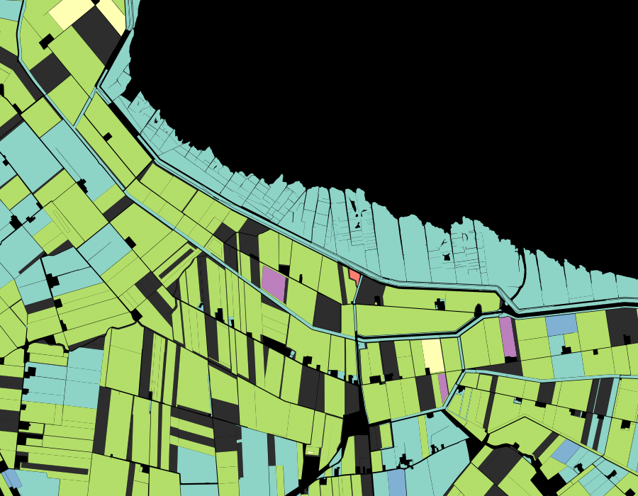

## Concept

Een website met interactieve kaart vertelt aan de hand van een aantal scenes uit De Graanrepubliek van Frans Westerman (en andere bronnen) over de Nederlandse landbouwgeschiedenis en het leven en de carriere van Sicco Mansholt. Links kaart, rechts verhaal met foto's/beelden. Wanneer de lezer naar beneden scrollt, animeert de kaart mee naar het gebied passend bij het huidige deel van het verhaal. 

In de kaart worden belangrijke plaatsen, gebouwen en gebieden gemarkeerd. De geografische data en de data die wordt gebruikt voor grafieken en tabellen etc. komen allemaal uit CitySDK, en zijn beschikbaar als open data.

Inspiratie:

- [A Game of Shark and Minnow - Who Will Win Control of the South China Sea?](http://www.nytimes.com/newsgraphics/2013/10/27/south-china-sea/)
- [Riding the New Silk Road](www.nytimes.com/newsgraphics/2013/07/21/silk-road/)

### Kaartvoorbeelden

Paar voorbeelden van percelenkaart, gekleurd naar gewas. Kleurschema nog niet definitief.

Geboortestreek Sicco Mansholt

Het Oldambt

Wieringermeerpolder